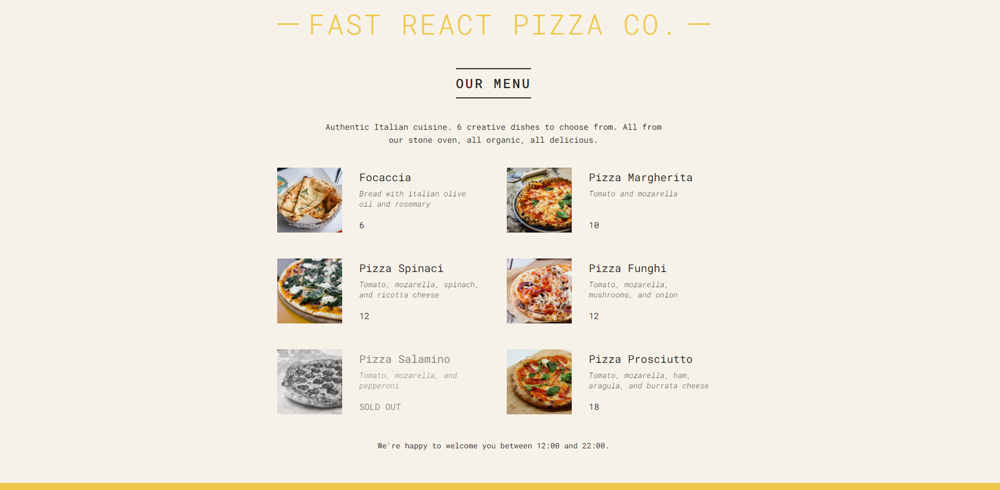

<div align="center">
  <h1> Menu de pizzaria simples</h1>
</div>

<p align="center">
  Este projeto é uma implementação simples de um cardápio para uma pizzaria, desenvolvido utilizando a biblioteca React.
</p>

<p align="center">
  <a href="#pré-requisitos">Pré requisitos</a> •  
  <a href="#rodando-a-aplicação">Rodando a aplicação</a> •
  <a href="#tecnologias">Tecnologias</a> •
  <a href="#autor">Autor</a>
</p>

---

<br>

# Screenshot do projeto

<a href="#">
  
</a>

# Pré requisitos

Você vai ter que ter instalado na sua máquina as seguintes ferramentas:

- [GIT](https://git-scm.com/)
- [Node.js](https://git-scm.com/)

Recomendo a utilização do [VS Code](https://code.visualstudio.com/) para editar o código.

# Rodando a aplicação

```bash
# Clone o repositório
git clone https://github.com/GreatWhoOne/menu-pizza.git

# Entre na pasta do projeto
cd menu-pizza

# Instale as dependências
npm install

# Rode a aplicação
npm start

# O servidor iniciará na porta: 3000 - acesse <http://localhost:3000/>
```

# Tecnologias

- [React](https://git-scm.com/)

# Autor

Feitor por Juan 🙋🏾 - [Veja meu LinkedIn](https://www.linkedin.com/in/juan-cruz-pereira/)
